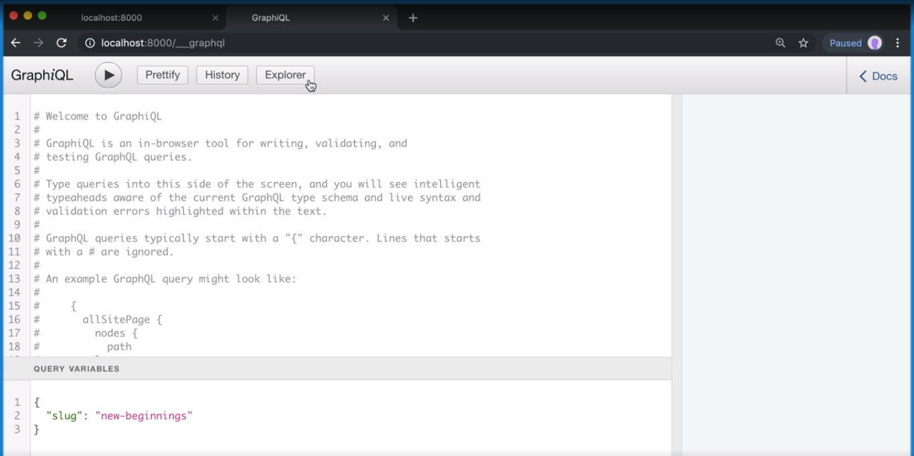
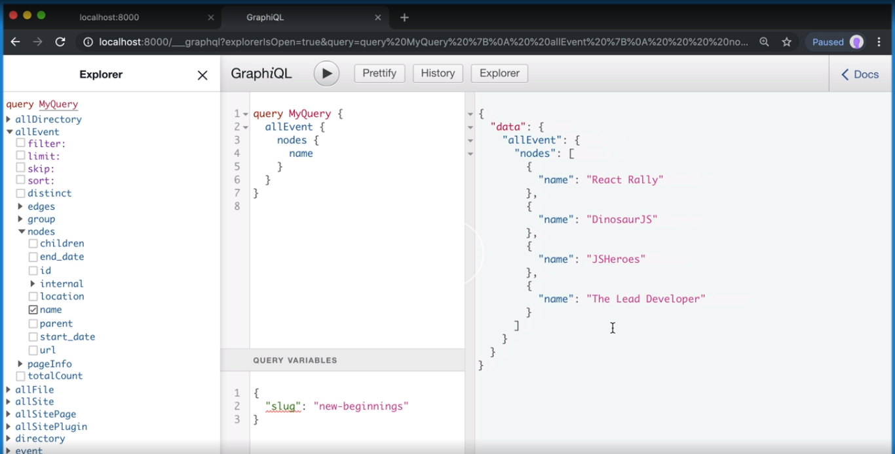

[Video Link](https://egghead.io/lessons/gatsby-add-static-data-to-a-gatsby-theme)

## Summary

In this lesson we learn how to load data from MDX (or any data source) and ensure the necessary folders exist.

## Notes

### ⚡ Getting the Data

To start working on our theme, we need some data to show. We are going to create `gatsby-theme-events/data/events.yml`. The data for the file can be found [here](https://raw.githubusercontent.com/jlengstorf/authoring-gatsby-themes/master/gatsby-theme-events/data/events.yml), just copy and paste it over.

#### gatsby-theme-events/data/events.yml

```yml
- name: The Lead Developer
  location: Austin, TX
  start_date: 2019-11-08
  end_date: 2019-11-08
  url: https://austin2019.theleaddeveloper.com/
```

### ⚡ Reading the Data

To be able to read and use this data in our theme, we have to install some dependencies.

```bash
$ yarn workspace gatsby-theme-events add gatsby-source-filesystem gatsby-transformer-yaml
```

Next we will set up a `gatsby-config.js` file to configure the plugins we just installed.

#### gatsby-theme-events/gatsby-config.js

```js
module.exports = {
  plugins: [
    {
      resolve: 'gatsby-source-filesystem',
      options: {
        path: 'data',
      },
    },
    {
      resolve: 'gatsby-transformer-yaml',
      options: {
        typeName: 'Event',
      },
    },
  ],
}
```

### ⚡ Starting the GraphQL server

Now that we have some data and our plugins configured, we'll check to make sure it's all working.

We'll run the following command, and click on the GraphQL link it gives us in the console (localhost:8000/\_\_\_graphql)

```bash
$ yarn workspace gatsby-theme-events develop
```

If everything works correctly, we should see the GraphQL playground.



### ⚡ Writing Our First Query

We'll first click on "Explorer". In the side panel we can see all of the available queries.

We'll select allEvent → nodes → name

When we hit the play button, our data will appear on the screen.



## Additional Resources

- [Gatsby config API](https://www.gatsbyjs.org/docs/gatsby-config/)

- [The gatsby-config.js API File](https://www.gatsbyjs.org/docs/api-files-gatsby-config/)
