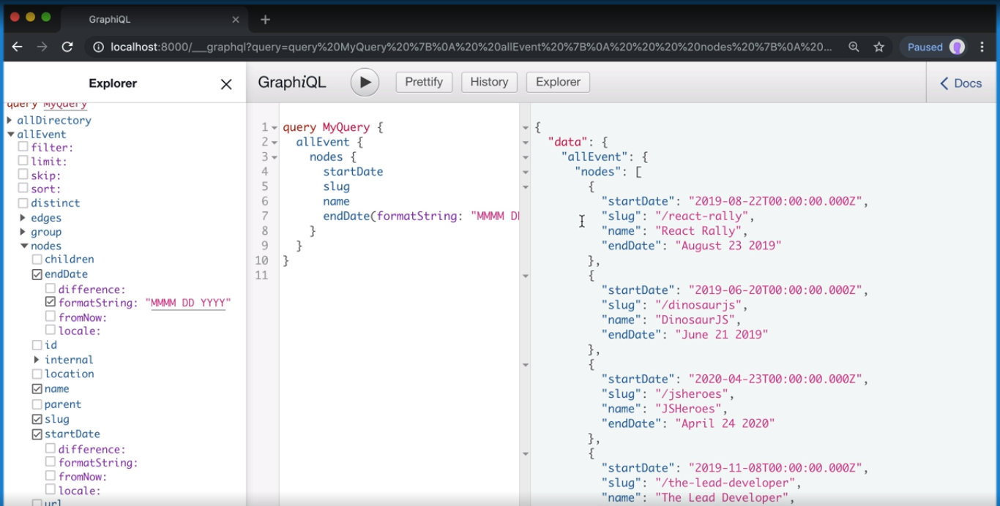

[Video Link](https://egghead.io/lessons/gatsby-set-up-to-create-data-driven-pages-in-gatsby)

## Summary

In this lesson we learn how to load data from MDX (or any data source) and ensure the necessary folders exist.

## Notes

### ⚡ Defining types

Our next step is to use the `sourceNodes` API which gives us an `actions` object.

We are going to define our event types using the `createTypes` action. Inside of backticks, we are going to define an Event type that implements the Node interface. We'll add `@dontInfer` because we don't want Gatsby to infer any fields, we want them explicitly defined.

#### gatsby-theme-events/gatsby-node.js

```js
exports.sourceNodes({ actions }) => {
  actions.createTypes(`
    type Event implements Node @dontInfer {

    }
  `)
}
```

Inside of the type definition, we'll add an `id` which is of type `ID!`, and `name` and `location`, which are of type `String!`.

For the date, we going to use Gatsby's built in `@dateformat` directive.

If we look at the events data, we'll see that it says `start_date`, but we want to use camelCase inside of our definition. To fix this we can use `@proxy(from: "start_date")`. It tells Gatsby where to pull the date from.

We can do the same thing for the end date by copying the previous line and swapping out the names.

Lastly we want to get the URL which is a string.

```js
exports.sourceNodes({ actions }) => {
  actions.createTypes(`
    type Event implements Node @dontInfer {
      id: ID!,
      name: String!,
      location: String!,
      startDate: Date! @dateformat @proxy(from: "start_date"),
      endDate: Date! @dateformat @proxy(from: "end_date"),
      url: String!
    }
  `)
}
```

### ⚡ Setting up the slug

We want to be able to create a URL on our own website, and for this we need a slug. Our slug is going to be a required string. It's not defined in our events data, so we're going to have to define it ourselves with a custom resolver.

```js
exports.sourceNodes({ actions }) => {
  actions.createTypes(`
    type Event implements Node @dontInfer {
      ...
      slug: String!
    }
  `)
}
```

Gatsby has a built in `createResolvers` API hook which gives us a `createResolvers` function.

Inside we are going to set up a variable for the base path which will be set to the site index.

Next we need to set up a function to create our slugs. We'll call this `slugify`. It will accept a string, which will be the name of the event, and then it will return a 'slugified string'.

Our first step is to turn the event name into a slug. We'll create a variable `slug` and set it to string.

We'll want to lowercase the string. We can do this with the `.toLowerCase()` string method.

Next we'll want to change any character that's not a letter or number into a hyphen using regex and the `.replace()` method.

Finally, we'll use another `replace` to remove any leading or trailing hyphens.

```js
export.createResolvers = ({createResolvers}) => {
  const basePath = '/'

  const slufigy = string => {
    const slug = string
      .toLowerCase()
      .replace(/[^a-z0-9]+/g, '-')
      .replace(/(^-|-$)+/g, '')
  }
}
```

Now that we have our slug, all that's left is to return it. We are going to include a `/`, the base path, another `slash`, and finally the slug.

The base path has a slash in it, and we also have slashes before and after the base path. To prevent over-slashing, we'll use regex to check for 2 or more slashes in a row and replace them with a single foward slash.

```js
export.createResolvers = ({createResolvers}) => {
  const basePath = '/'

  const slufigy = string => {
    const slug = string
      .toLowerCase()
      .replace(/[^a-z0-9]+/g, '-')
      .replace(/(^-|-$)+/g, '')

      return `/${basePath/${slug}`.replace(/\/\/+/g, '/')
  }
}
```

We do this because if we decide to change the base path or set it from an option (coming up in a future lesson), we want to make sure that we don't accidently break our slugs.

### ⚡ Creating the resolvers

Now that have our slugify function, we can create our resolvers with the `createResolvers` function.

We'll pass it an object. We'll get the `Event` type → `slug` field, and then we want to set a function to resolve it.

The function gets a `source`, which in this case is the event node. We want to return a slugified version of the event name, which for us is `source.name`.

```js
export.createResolvers = ({createResolvers}) => {
  ...

  createResolvers({
    Event: {
      slug: {
        resolve: source => slugify(source.name)
      }
    }
  })
}
```

### ⚡ Testing it all out

We can test if everything is working by running the following command:

```bash
$ yarn workspace gatsby-theme-events develop
```

Open the GraphQL playground by clicking the link in your terminal or typing `http://localhost:8000/___graphql` into the address bar.

Once the playground is open, we should be able to select allEvents → nodes → startDate, endDate and the slug.

Because we define the dates as date types, we also get some format helper functions.



## Additional Resources

- [Create Resolvers](https://www.gatsbyjs.org/docs/node-apis/#createResolvers)
