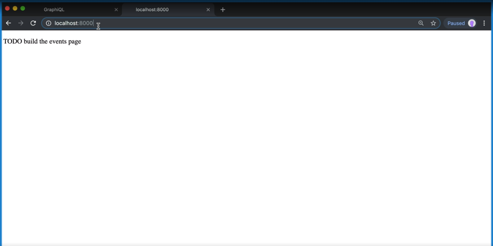
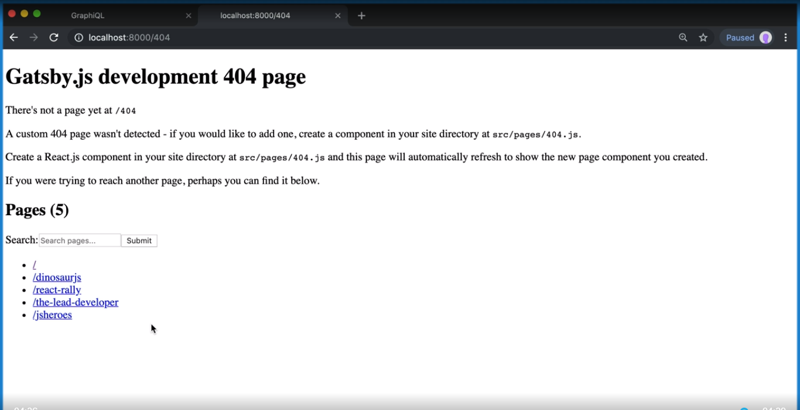

[Video Link](https://egghead.io/lessons/gatsby-create-data-driven-pages-in-gatsby-with-graphql-and-createpages)

## Summary

In this lesson we learn how to use the createPages API hook.

## Notes

### ⚡ Create our first page

The last thing we need to do is create event previews and individual event pages.

We can do this with the `createPages` API hook. This will be a `async` function because we are going to be running a GraphQL query.

Well grab `actions`, `graphql`, and `reporter`. Then we'll create a `basePath` variable and set that to `/`.

Next we'll set up our first page using `actions.createPage()`. We'll pass in an object with the path and component to be rendered.

_The component does not exists yet._ We'll create it soon.

#### gatsby-theme-events/gatsby-node.js

```js
exports.createPages = ({ actions, graphql, reporter }) => {
  const basePath = '/'

  actions.createPage({
    path: basePath,
    component: require.resolve('./src/templates/events.js'),
  })
}
```

### ⚡ Querying the events

Next we'll set up our GraphQL query for individual events and store the data we get back in a variable called `result`.

We are going to query `allEvent`, and we're going to want to sort them by the start date.

All we need from `allEvent` is nodes, and from that, the `id` and `slug`.

```js
exports.createPages = ({ actions, graphql, reporter }) => {
  ...

  const result = await graphql(`
    query {
      allEvent(sort: { fields: startDate, order: ASC }) {
        nodes {
          id
          slug
        }
      }
    }
  `)
}
```

### ⚡ Catching errors

If anything goes wrong with our query, it will show up in `result.error`.

If there is an error, we call `reporter.panic` which will cause a build error and display a message. Then we'll early return.

```js
...

if(result.error {
  reporter.panic('Error loading events', reporter.errors)

  return
})
```

### ⚡ Creating individual event pages

If everything goes well, we can grab our events from `result.data.allEvent.nodes`. Well loop through each event and grab the slug and call the `createPage` action.

We'll pass in a path, component and context. Context helps us identify which event is which. We can set the `eventID` as context, and that will be pulled out of `event.id`.

```js
...

const events = result.data.allEvent.nodes

events.forEach(event => {
  const slug = event.slug

  actions.createPage({
    path: slug,
    component: require.resolve('./src/templates.event.js'),
    context: {
      eventID: event.id
    }
  })
})
```

### ⚡ Creating the components

To make sure our pages are created sucessfully, we need to create our components that we passed to `actions.createPage`. They are not going to display any event data yet.

First we'll create `./src/templates/events.js`.

#### events.js

```js
import React from 'react'

const EventsTemplate = () => <p>TODO: Build the events page</p>

export default EventsTemplate
```

Next we'll create `./src/templates/event.js`. We can copy everything from `events.js` and paste it over.

#### event.js

```js
import React from 'react'

const EventTemplate = () => <p>TODO: Build the event page</p>

export default EventTemplate
```

### ⚡ Testing it all out

We can test if everything is working by running the following command:

```bash
$ yarn workspace gatsby-theme-events develop
```

That will give us a localhost link. When we load the site we should see our events page.



If we trigger the 404 page, we'll see that our event pages have also been created! 🎉



## Additional Resources

- [createPages API](https://www.gatsbyjs.org/docs/node-apis/#createPages)
