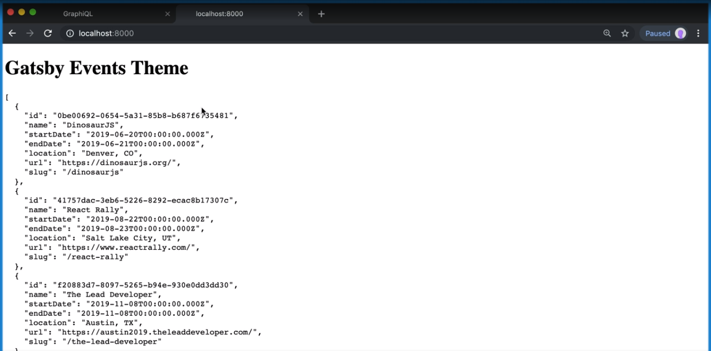
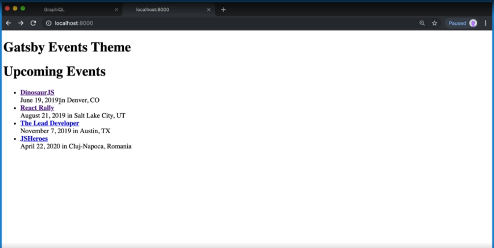

[Video Link](https://egghead.io/lessons/gatsby-display-sorted-data-with-usestaticquery-in-gatsby)

## Summary

In this lesson we learn how to display event data on the events page.

## Notes

### ⚡ Querying the event data

To show event data, we going to import `graphql` and `useStaticQuery` from Gatsby.

We're going to create a `data` variable, and that's going to be the result of the `useStaticQuery` hook. The query that wer're going to run is `allEvent`, and we're going to sort by the start date.

From each node (event), we want to pull the id, name start date, end date, location, URL and slug.

#### src/templates/events.js

```js
import React from 'react'
import { graphql, useStaticQuery } from 'gatsby'

const EventsTemplate = () => {
  const data = useStaticQuery(graphql`
    allEvent(sort: { fields: startDate, order: ASC }) {
      node {
        id
        name
        startDate
        endDate
        location
        url
        slug
      }
    }
  `)

  return <p>TODO: Build the events page</p>
}
```

To make things a little easier to read, we'll create an `events` variable and set that to `data.allEvent.nodes`.

### ⚡ Creating reusable components

We want to pass the event data into a component. First we want to create a general layout that we can reuse across multiple files, and then we want to create an event list component that will take the events as props.

```js
import React from 'react'
import {graphql, useStaticQuery} from 'gatsby'

const EventsTemplate = () => {

  ...

  const events = data.allEvent.nodes

  return (
    <Layout>
      <EventList events={events} />
    </Layout>
  )
}
```

Now let's create those components. First we're going to create a `components` directory, and inside of that a `layout.js` file.

We'll name this component `Layout`, and it will recieve a `children` prop. The `children` prop is whatever is between the opening and closing tags of the component.

For now, our layout component will just return a div with a heading tag and the children.

### src/components/layout.js

```js
import React from 'react'

const Layout = ({ children }) => (
  <div>
    <h1>Gatsby Events Theme</h1>
    {children}
  </div>
)

export default Layout
```

Next we're going to create the events list component inside of the `components` directory. We'll name it `event-list.js`.

Our event list component will be named `EventList`, and it will take one prop, `events`. For now we'll just dump the raw data to the screen.

### src/components/event-list.js

```js
import React from 'react'

const EventList = ({ events }) => <pre>{JSON.stringify(events, null, 2)}</pre>

export default EventList
```

### ⚡ Using our components

Now let's go back to `events.js` and import our components.

#### src/templates/events.js

```js
import React from 'react'
import { graphql, useStaticQuery } from 'gatsby'

// Our new component imports
import Layout from '../components/layout'
import EventList from '../components/event-list'
```

We'll save the file and start up the dev server.

```bash
$ yarn workspace gatsby-theme-events develop
```

When we open localhost:8000, we should see that our layout is there along with all of our event data.



### ⚡ Organizing and displaying the data

Now let's go back to our event list component and make things look a little better. We can get rid of the `pre` tag and replace that with a fragment.

Inside of the fragment, we'll put a heading and an unordered list. Inside of the undordered list tags, we'll map over the events and return a list item.

Each list item needs a key, so for that we can use the event id. Then we'll add a `strong` tag that will be an internal link.

To create that link, we're going to import the `Link` component from Gatsby.

### src/components/event-list.js

```js
import React from 'react'

// We use this to create our link
import { Link } from 'gatsby'

const EventList = ({ events }) => (
<>
  <h1>Upcoming Events</h1>
  <ul>
    {events.map(event => {
      <li key={event.id}>
        <strong>
          <Link to={event.slug}>{event.name}</Link>
        </strong>
      </li>
    })}
  <ul/>
</h1>
)

export default EventList
```

Under the `strong` tag we'll add a line break and under that we'll add the date and location.

```js
const EventList = ({ events }) => (
<>
  <h1>Upcoming Events</h1>
  <ul>
    {events.map(event => {
      <li key={event.id}>
       ...

       <br />

       {new Date(event.startDate.toLocaleDateString('en-US', {
         month: 'long',
         day: 'numeric',
         year: 'numeric'
       }))} in {event.location}
      </li>
    })}
  <ul/>
</h1>
)
```

If we save and go back to the browser, we should see that everything looks more readable.



## Additional Resources

- [Date.prototype.toLocaleString()
  ](https://developer.mozilla.org/en-US/docs/Web/JavaScript/Reference/Global_Objects/Date/toLocaleString)
