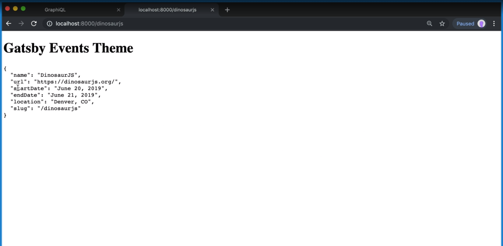
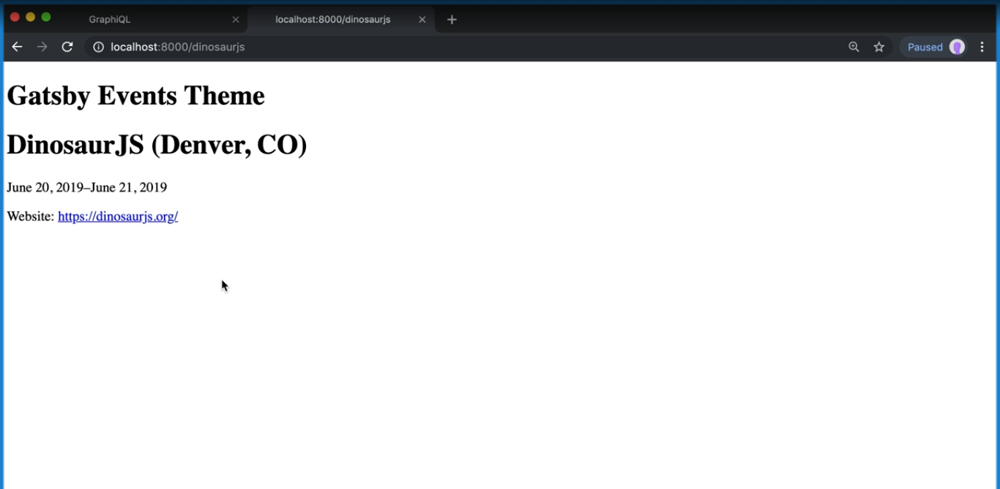

[Video Link](https://egghead.io/lessons/gatsby-display-sorted-data-with-usestaticquery-in-gatsby)

## Summary

In this lesson we set up the individual event page.

## Notes

### ⚡ Querying the individual event data

To display the indiviual event page, we'll have a similar setup as the events page.

We'll import `graphql` from Gatsby, and then we have to export a page query. We do this so we have access to graphql variables. When we create pages using `createPage` and add context, that context becomes available in the graphql query.

Next we'll query for the event that matches the `eventID` that we passed in context. We want to get the event name, url, start date, end date, location and slug.

#### src/templates/event.js

```js
import React from 'react'
import { graphql } from 'gatsby'

export const query = graphql`
  query($eventID: String!) {
    event(id: { eq: $eventID }) {
      name
      url
      startDate(formatString: "MMMM D, YYYY")
      endDate(formatString: "MMMM D, YYYY")
      location
      slug
    }
  }
`

const EventTemplate = () => {}
```

### ⚡ Displaying the individual event data

The result from the exported page query gets injected into our component as a `data` prop.

We can destructure the `data` prop that gets passed to `EventTemplate` and then spread out the `event` into a new `Event` component that we're going to create.

```js

...

// We can destructure the data prop like this
const EventTemplate = ({ data: { event } }) => {
  <Layout>
    <Event {...event} />
  </Layout>
}
```

We can go to the `components` directory and create a file called `event.js`.

We'll set up a basic `Event` component, dump the props to the screen inside of a `pre` tag and export the component as default.

#### src/components/event.js

```js
import React from 'react'

const Event = props => <pre>{JSON.stringify(props, null, 2)}</pre>

export default Event
```

If we import this inside of `templates/event.js` and navigate to an event page, we should see our event data.

#### src/templates/event.js

```js
import Event from '../components/event'
```



### ⚡ Cleaning everything up

Now that we see that all of our data is getting passed to the `Event` component, we can make it look a little better.

We can destructure the props, and we'll return a div with the data nicely formatted with heading and paragraph tags.

#### src/components/event.js

```js
import React from 'react'

const Event = ({ name, location, url, startDate, endDate }) => (
  <div>
    <h1>
      {name} ({location})
    </h1>
    <p>
      {startDate}-{endDate}
    </p>
    <p>
      Website: <a href={website}>{url}</a>
    </p>
  </div>
)

export default Event
```

Once we save this file and have a look at the browser, we should see our updated event page.


