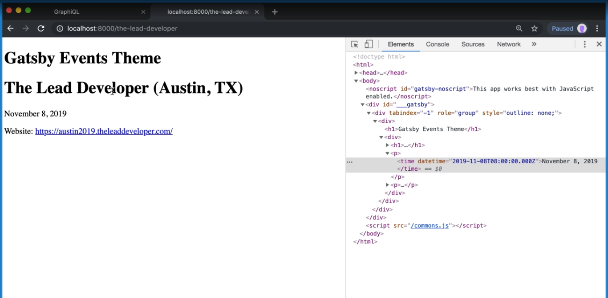
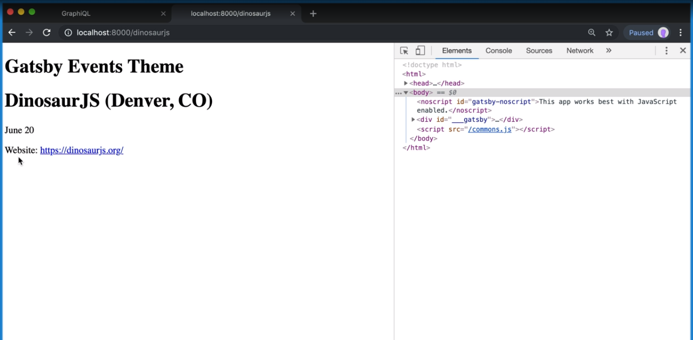

[Video Link](https://egghead.io/lessons/react-style-and-format-dates-in-react)

## Summary

In this lesson we learn how to make the event dates more human readable.

## Notes

### ⚡ Setting up the date component

Currently our event dates are just right next to one another, separated by a dash (`startDate - endDate`). Our goal is to refactor the `Event` component and add some logic to make the date a little more readable.

We'll start out by creating a new component called `EventDate` that will take `startDate` and `endDate` as props.

Next we'll turn both the start date and end date into new date objects.

We can check if the event is a one day event by comparing the start and end dates using `.toDateString()` method.

#### src/components/event.js

```js
const EventDate = ({ startDate, endDate }) => {
  const start = new Date(startDate)
  const end = new Date(endDate)

  const isOneDay = start.toDateString() === end.toDateString()
}

const Event = () => {...}
```

After that we can return a fragment, and inside of that, a `time` tag. We will pass it `dateTime` so it's machine parsable.

```js
const EventDate = ({ startDate, endDate }) => {
  ...

  return (
    <>
      <time dateTime=''></time>
    </time>
  )
}
```

### ⚡ The logic

If the event takes place over multiple days in the same month, we want it to display the month, days and year.

> June 21-23, 2019

If it's a one day event, we want it to show the month, day and year.

> June 21, 2019

And if it's a multiple day event that crosses months, we want it to show the first month and day to the second month, day and year.

> June 30 - July 2, 2019

### ⚡ Setting up the start date

To get started, we'll create a helper function `getDate`. That will take in our date, and we're going to pass in an object saying whether or not we want to show the day, month and year. All of those will default to `true`.

```js
const getDate = (date, {day = true, month = true, year = true} = {}) = {}

const EventDate = () => {...}
```

What we're going to return back is the `date.toLocaleDateString()`. The day and year will be set to `'numeric'` if true, and month will be set to `'long'` if true.

```js
const getDate = (date, {day = true, month = true, year = true} = {}) = {
  date.toLocaleDateString('en-US', {
    day: day ? 'numeric' : undefined,
    month: month ? 'long' : undefined,
    year: year ? 'numeric' : undefined,
  })
}
```

Now we can use this helper function back inside of our `EventDate` component.

Inside of the `time` tag, we'll call the function with the start date and tell it we only want to show the year if it's a one day event. We can also pass the start date to the time `dateTime` attribute.

```js
const EventDate = ({ startDate, endDate }) => {
  ...

  return (
    <>
      <time dateTime={start.toISOString()}>{getDate(start, { year: isOneDay })}</time>
    </>
  )
}
```

Now let's use our `EventDate` component back inside of `Event` component.

```js
const Event = ({ name, location, url, startDate, endDate }) => (
  <div>
    <h1>
      {name} ({location})
    </h1>
    <p>
      <EventDate startDate={startDate} endDate={endDate} />
    </p>
    <p>
      Website: <a href={website}>{url}</a>
    </p>
  </div>
)
```

Because this event is only one day, it shows us the year.



If we look at a multiple day event, we can see that it doesn't display the year.



### ⚡ Setting up the end date

Now to finish up the logic!

Back inside of the `EventDate` component, we will check if the event is not for one day. If it's not, we will return a '-' and another `time` tag for the end date.

Inside of the `time` tag, we can use our `getDate` helper function. We'll pass it the end date, and we only want to display the end month if it is not the same as the start month.

```js
const EventDate = ({ startDate, endDate }) => {
  ...

  return (
    <>
      <time dateTime={start.toISOString()}>{getDate(start, { year: isOneDay })}</time>
      {!isOneDate && (
        <>
          -
          <time dateTime={end.toISOString()}>getDate(end, { start.getMonth !== end.getMonth()})</time>
        </>
      )}
    </>
  )
}
```

If we save and head back to the browser, we'll see that our dates are formatted how they are supposed to be.


