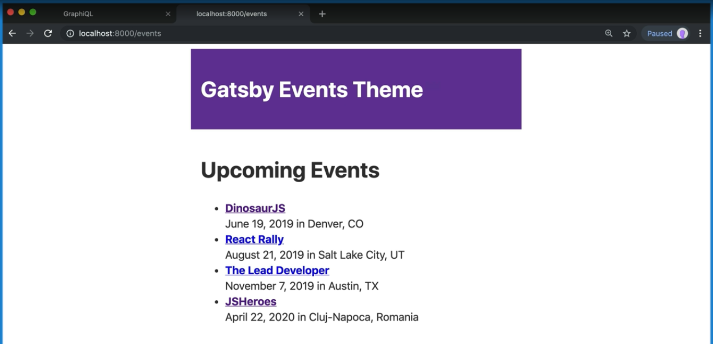

[Video Link](https://egghead.io/lessons/gatsby-use-and-override-a-theme-in-gatsby-with-component-shadowing)

## Summary

In this lesson we learn how to apply the styles we set to our theme.

## Notes

### ⚡ Using the theme

To use the theme we defined, we use "component shadowing" to override the default styles.

We create a folder with the same name as the theme in the `src` folder. Then we're going to "shadow" the `index.js` file, which is where the theme is defined.

#### gatsby-theme-events/src/gatsby-theme-ui/index.js

```js
import { theme } from './theme'

export default theme
```

Next we'll refactor our `Layout` component to use `theme-ui`.

We'll import `Layout` and alias that as `ThemeLayout` so it doesn't have the same name as our layout component. Next will import `Header`, `Main`, and `Container` from `theme-ui`.

#### gatsby-theme-events/src/components/layout.js

```js
import React from 'react'

// Import Layout as ThemeLayout so the name doesn't conflict with our Layout component
import { Layout as ThemeLayout, Header, Main, Container } from 'theme-ui'

const Layout = ({ children }) => {}

export default Layout
```

Now we can start using our theme components. We will replace the wrapper div with `ThemeLayout`, and we'll set up the `Header` component. We'll put the `h1` element inside of the header.

Next we'll add the `Main` component with a `Container` inside of it. The `children` prop goes inside of the container.

```js
import React from 'react'
import { Layout as ThemeLayout, Header, Main, Container } from 'theme-ui'

const Layout = ({ children }) => {
  const meta = useSiteMetadata()

  return (
    <ThemeLayout>
      <Header>
        <h1>Gatsby Events Theme</h1>
      </Header>
      <Main>
        <Container>{children}</Container>
      </Main>
    </ThemeLayout>
  )
}

export default Layout
```

### ⚡ Testing everything out

To make sure everything is working correctly, start up the dev server with the following command:

```bash
$ yarn workspace site develop
```

Once the site loads, you should see that our styles have been applied.



### ⚡ Using `Styled`

We can also use the `Styled` import from `theme-ui` to apply the styles we set for HTML elements.

```js
import { Styled } from 'theme-ui'

const EventList = ({ events }) => {
  const meta = useSiteMetadata()

  return (
    <>
      {/* Here we replace the h1 with Styled.h1 */}
      <Styled.h1>Upcoming Events</Styled.h1>
      <Styled.ul>
        {events.map(event => (
          <Styled.li key={event.id}>
            <strong>
              <Link to={event.slug}>{event.name}</Link>
            </strong>
            <br />
            {new Date(event.startDate).toLocaleDateString('en-US', {
              month: 'long',
              day: 'numeric',
              year: 'numeric',
            })}{' '}
            in {event.location}
          </Styled.li>
        ))}
      </Styled.ul>
    </>
  )
}
```
